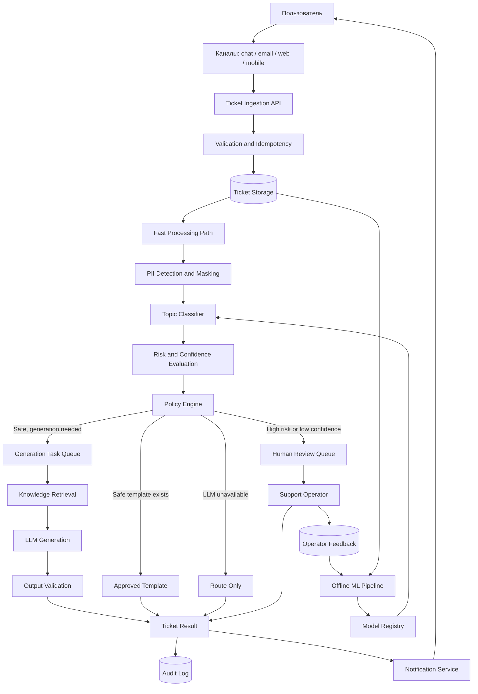
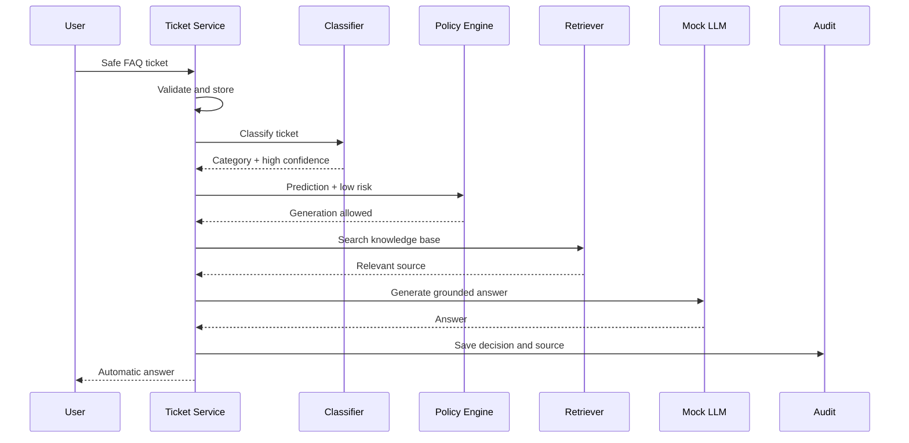
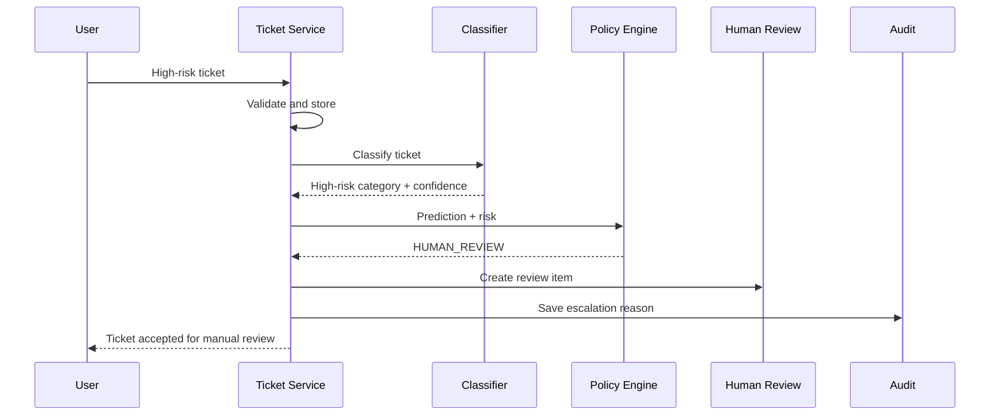
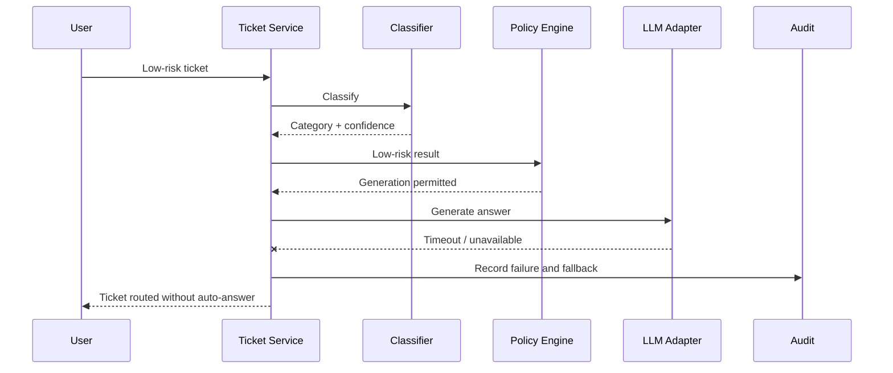
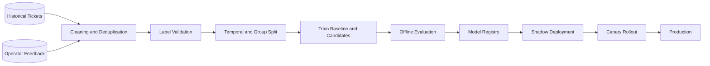

# Архитектура системы

## 1. Архитектурные цели

Архитектура должна одновременно обеспечивать:

- классификацию и маршрутизацию тикета примерно за 500 мс;
- обработку кратковременных всплесков до 10–20 тысяч тикетов
  за 10 минут;
- безопасную автоматизацию типовых обращений;
- независимость основного контура от доступности LLM;
- обязательную ручную проверку рискованных и неуверенных случаев;
- сохранение и аудит автоматических решений;
- контроль стоимости LLM-инференса;
- возможность постепенно развивать PoC до production-системы.

Цель решения — не автоматизировать все обращения, а отделить
безопасные типовые сценарии от случаев, требующих участия оператора.

## 2. Оценка нагрузки

Средний поток:

```text
200 000 / 86 400 ≈ 2,3 тикета в секунду.
```

Пиковый поток:

```text
10 000 / 600 ≈ 16,7 тикета в секунду.
20 000 / 600 ≈ 33,3 тикета в секунду.
```

Таким образом, API и быстрый ML-контур проектируются с запасом
на кратковременную нагрузку не менее 35 тикетов в секунду.

Большую опасность представляет не сам входящий RPS, а медленный
и дорогой LLM-инференс. Поэтому генерация не должна находиться
в обязательном синхронном пути каждого тикета.

## 3. Архитектурный стиль

Для production предлагается архитектура типа Web–Queue–Worker:

- быстрый синхронный контур принимает, сохраняет, классифицирует
  и маршрутизирует тикет;
- медленный асинхронный контур выполняет retrieval и LLM-генерацию;
- рискованные и low-confidence случаи помещаются в очередь операторов;
- аналитика, переобучение и обновление базы знаний выполняются offline.

Для PoC используется модульный монолит:

- один локально запускаемый процесс;
- отдельные доменные компоненты и интерфейсы;
- mock-реализации внешних сервисов;
- отсутствие production-инфраструктуры.

Модульный монолит позволяет показать архитектурные границы,
не расходуя четырёхчасовой тайм-бокс на настройку распределённой
инфраструктуры.

## 4. Высокоуровневая архитектура



## 5. Основные компоненты

### 5.1. Channel Adapters

Принимают обращения из:

- чата;
- email;
- web-формы;
- мобильного приложения.

Адаптеры приводят входы разных каналов к единой структуре `Ticket`.

В PoC каналы заменяются заранее подготовленными mock-тикетами,
которые передаются через CLI или demo-script.

### 5.2. Ticket Ingestion API

Отвечает за:

- приём тикета;
- проверку формата;
- аутентификационный контекст;
- передачу тикета в сервис обработки;
- возврат идентификатора и статуса.

API не выполняет тяжёлую LLM-генерацию внутри обязательного
пользовательского запроса.

В PoC отдельный HTTP API не реализуется. Его роль выполняет
application service, вызываемый из demo-script.

### 5.3. Validation and Idempotency

Проверяет:

- обязательные поля;
- допустимую длину текста;
- корректность канала;
- наличие стабильного `ticket_id`;
- отсутствие повторной обработки того же тикета.

Повторный запрос с тем же `ticket_id` не должен создавать
дубликат или повторный автоматический ответ.

В production уникальность обеспечивается ограничением в основной БД.
В PoC используется проверка in-memory repository.

### 5.4. Ticket Storage

Является источником истины для:

- исходного тикета;
- текущего статуса;
- категории;
- confidence;
- назначенной команды;
- результата обработки;
- причины эскалации;
- версии моделей и policy.

Для production предполагается реляционное хранилище, например PostgreSQL.

PoC использует in-memory repository. Интерфейс репозитория должен
позволять заменить его реальной БД без изменения доменной логики.

### 5.5. PII Detector

Определяет чувствительные данные до передачи тикета внешним сервисам.

Возможные действия:

- маскирование;
- запрет внешнего LLM-вызова;
- передача тикета оператору;
- сохранение только безопасной версии текста в логах.

В PoC используется простая детерминированная реализация,
например набор регулярных выражений.

PII detector в PoC показывает архитектурную точку контроля,
но не считается полноценной системой защиты персональных данных.

### 5.6. Topic Classifier

Предсказывает:

- категорию тикета;
- confidence;
- предполагаемую команду обработки.

Для production первым baseline может быть TF-IDF
с логистической регрессией.

Более сложная модель принимается только при доказанном улучшении
качества на той же схеме валидации.

В PoC используется `MockClassifier`, который детерминированно
возвращает результаты для демонстрационных сценариев.

### 5.7. Risk Evaluation

Risk и confidence являются разными сигналами.

Confidence характеризует уверенность модели в классификации.

Risk характеризует последствия ошибочной автоматизации
для конкретной категории.

Пример:

```text
категория определена с confidence 0,98,
но относится к высокорисковой;
следовательно, автоматический ответ запрещён.
```

Risk может определяться правилами, бизнес-конфигурацией
и дополнительными моделями.

### 5.8. Policy Engine

Policy Engine отделён от классификатора и принимает итоговое
системное решение.

Возможные решения:

- `AUTO_ANSWER`;
- `DRAFT_FOR_OPERATOR`;
- `ROUTE_ONLY`;
- `HUMAN_REVIEW`.

Упрощённая логика:

```text
если категория high-risk:
    HUMAN_REVIEW

иначе если confidence ниже порога:
    HUMAN_REVIEW

иначе если PII нельзя безопасно обработать:
    HUMAN_REVIEW

иначе если существует утверждённый шаблон:
    AUTO_ANSWER

иначе если LLM доступна и retrieval релевантен:
    AUTO_ANSWER или DRAFT_FOR_OPERATOR

иначе:
    ROUTE_ONLY
```

Порог confidence в PoC является демонстрационным.
В production он выбирается на валидационной выборке с учётом
качества и доступной мощности операторов.

### 5.9. Knowledge Retrieval

Находит:

- релевантные фрагменты базы знаний;
- похожие исторические тикеты;
- утверждённые инструкции.

Production-вариант может использовать гибридный поиск:

- BM25 для точных терминов и кодов ошибок;
- embeddings для семантического сходства;
- reranker для уточнения порядка кандидатов.

В PoC используется небольшая локальная база знаний
и простой keyword или TF-IDF retrieval.

Retriever возвращает:

- идентификатор источника;
- текст фрагмента;
- оценку релевантности.

Если релевантность недостаточна, LLM не должна формировать
уверенный автоматический ответ.

### 5.10. LLM Adapter

LLM используется только для формирования текста на основании
найденного контекста.

LLM не принимает окончательное бизнес-решение и не используется
для обязательной классификации или маршрутизации.

В production LLM находится за отдельным интерфейсом,
который позволяет:

- менять провайдера;
- использовать внешнюю или локальную модель;
- задавать timeout;
- контролировать токены и стоимость;
- реализовать retries и circuit breaker.

В PoC используется детерминированный `MockLLMClient`
без API-ключей и сетевых вызовов.

### 5.11. Output Validation

До отправки ответа проверяются:

- наличие подтверждающего источника;
- допустимый формат;
- отсутствие запрещённых действий;
- отсутствие незамаскированных PII;
- соответствие выбранной категории;
- возможность автоматической отправки.

Одного LLM confidence недостаточно для разрешения ответа.

### 5.12. Human Review Queue

Содержит тикеты, для которых:

- категория высокорисковая;
- confidence ниже порога;
- нет релевантного источника;
- обнаружены небезопасные данные;
- автоматическая генерация недоступна и одной маршрутизации недостаточно.

Оператор получает:

- исходный тикет;
- предсказанную категорию;
- confidence;
- риск;
- предполагаемый маршрут;
- найденные источники;
- причину эскалации.

В production очередь операторов может храниться как бизнес-состояние
в реляционной БД.

В PoC используется in-memory review repository.

### 5.13. Audit Log

Для каждого решения сохраняются:

- `ticket_id`;
- время;
- входной статус;
- версия классификатора;
- категория;
- confidence;
- risk;
- найденные источники;
- версия policy;
- решение;
- причина эскалации;
- статус внешних сервисов;
- итоговый результат.

Исходные PII и секреты не должны попадать в технические логи.

В PoC аудит реализуется списком событий или JSONL-файлом.

## 6. Синхронный быстрый путь

К синхронному fast path относятся:

1. Приём тикета.
2. Техническая валидация.
3. Проверка идемпотентности.
4. Сохранение исходного тикета.
5. Быстрый PII scan.
6. Классификация темы.
7. Оценка confidence и риска.
8. Выбор команды.
9. Решение Policy Engine.
10. Возврат статуса обработки.

Целевое время классификации и маршрутизации — около 500 мс.

LLM не входит в обязательный fast path.

## 7. Асинхронный медленный путь

К slow path относятся:

- retrieval по расширенной базе знаний;
- reranking;
- LLM-генерация;
- сложная проверка ответа;
- human review;
- уведомления, не требуемые для первичного подтверждения;
- расширенная аналитика.

Очередь отделяет скорость поступления тикетов от скорости
медленных workers.

Если входящий поток долго превышает производительность workers,
очередь будет расти. Поэтому нужны:

- горизонтальное масштабирование workers;
- ограничение параллелизма LLM;
- приоритизация;
- мониторинг возраста старейшей задачи;
- degraded mode;
- сокращение доли тикетов, отправляемых в LLM.

## 8. Happy path



Условия автоматического ответа:

- тикет валиден;
- категория низкорисковая;
- confidence выше порога;
- PII безопасно обработаны;
- найден релевантный источник;
- генерация прошла проверку.

## 9. Risky path



Высокий confidence не отменяет требование ручной проверки
для высокорисковой категории.

## 10. Отказ LLM



При отказе LLM:

- исходный тикет остаётся сохранённым;
- классификация продолжает работать;
- риск продолжает оцениваться;
- тикет маршрутизируется нужной команде;
- автоматический ответ не отправляется;
- статус меняется на `DEGRADED`;
- итоговое действие — `ROUTE_ONLY`.

Если одновременно присутствует высокий риск или низкий confidence,
выбирается `HUMAN_REVIEW`.

## 11. Надёжность

### Идемпотентность

Повторная доставка одного `ticket_id` не должна:

- создавать второй тикет;
- повторно отправлять ответ;
- создавать дублирующее действие оператора.

### Retry

Повторяются только временные ошибки:

- timeout;
- HTTP 429;
- HTTP 5xx.

Ошибки входных данных и safety-ограничения не повторяются.

### Backoff и jitter

Повторные вызовы выполняются с увеличивающейся задержкой
и случайным отклонением, чтобы избежать retry storm.

### Circuit breaker

После серии ошибок LLM-вызовы временно блокируются.
Новые тикеты обрабатываются без генерации.

### Dead-letter queue

Задачи, которые не удалось обработать после ограниченного
числа попыток, перемещаются в DLQ для анализа и replay.

### Delivery semantics

Для фоновых задач используется at-least-once delivery
с идемпотентными consumers.

### Transactional Outbox

В production изменение состояния тикета и событие для очереди
фиксируются через Transactional Outbox, чтобы избежать dual write.

Эти механизмы описываются в архитектуре, но не реализуются
как распределённая инфраструктура в PoC.

## 12. Хранилища

### Реляционная БД

Хранит:

- тикеты;
- статусы;
- результаты классификации;
- policy decisions;
- очередь операторов;
- feedback;
- аудит или ссылки на расширенный аудит.

### База знаний

Хранит:

- исходные документы;
- версии;
- права доступа;
- chunks;
- metadata.

### Векторный индекс

Хранит поисковое представление chunks.

Индекс является производным представлением,
а не единственным источником документов.

### Кэш

Может использоваться для:

- утверждённых шаблонов;
- конфигурации Policy Engine;
- справочника команд;
- популярных материалов базы знаний.

Кэш не является источником критического бизнес-состояния.

## 13. Offline-контур



Offline-контур включает:

- сбор исторических тикетов;
- очистку;
- дедупликацию;
- проверку labels;
- временное разделение данных;
- обучение baseline;
- сравнение кандидатов;
- регистрацию модели;
- shadow deployment;
- canary rollout;
- rollback.

## 14. Production и PoC

| Production-компонент | Реализация в PoC |
|---|---|
| Channel adapters | Mock tickets |
| HTTP API | CLI/demo-script |
| PostgreSQL | In-memory repository |
| Message broker | Последовательные вызовы или простой список |
| ML classifier service | `MockClassifier` |
| PII service | Простая локальная проверка |
| Knowledge base | Небольшой JSON-файл |
| Vector search | Keyword или TF-IDF retrieval |
| LLM API | `MockLLMClient` |
| Human review workflow | In-memory review repository |
| Centralized audit | List или JSONL |
| Monitoring platform | Логи и тестовые счётчики |
| Retry/circuit breaker/DLQ | Документированы, но не развёрнуты |

## 15. Основные trade-offs

### Качество против latency

Тяжёлые модели и LLM могут повысить качество ответа,
но не должны блокировать классификацию и маршрутизацию.

### Автоматизация против риска

Более агрессивная автоматизация снижает стоимость,
но может ухудшить CSAT, reopen rate и безопасность.

### Качество против стоимости

LLM вызывается только после Policy Engine и retrieval,
а не для каждого тикета.

### Простота PoC против production-полноты

PoC использует in-memory и mock-компоненты,
но сохраняет production-интерфейсы и data flow.

### Availability против полноты ответа

При отказе LLM система возвращает ограниченный результат
и продолжает маршрутизацию вместо полного отказа.

## 16. Архитектурные ограничения

- LLM не является источником истины.
- LLM не принимает high-risk решения.
- Confidence не заменяет risk policy.
- Кэш и очередь не являются источниками состояния тикета.
- Векторный индекс не является единственным хранилищем документов.
- Тикет сохраняется до запуска необязательной генерации.
- Отказ LLM не должен приводить к потере тикета.
- Низкая релевантность retrieval запрещает уверенный автоматический ответ.
- Все автоматические решения должны быть аудируемыми.